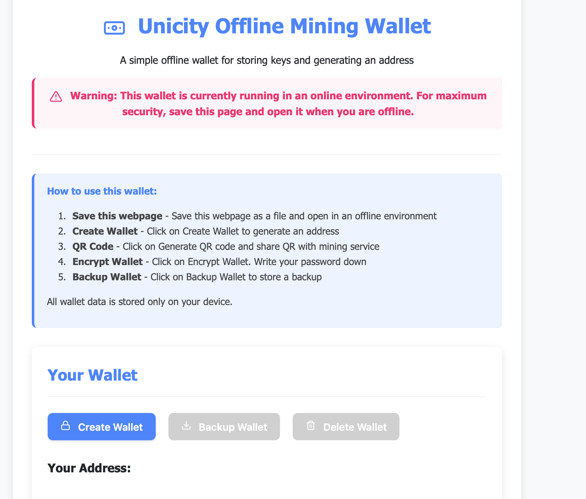

# Unicity Offline Wallet

A simple, secure, client-side wallet that runs entirely in your browser. The  Wallet is designed for offline use, allowing you to manage private keys and generate addresses without exposing sensitive information to the internet.



## Features

- **100% Client-Side**: All code runs in your browser - no data is ever sent to any server
- **Offline Capable**: Save the HTML file and run it offline for maximum security
- **Private Key Management**: Securely generate and manage private keys
- **QR Code Support**: Generate QR codes for easy address sharing
- **Wallet Encryption**: Protect your private keys with password encryption
- **WIF Format**: Export private keys in Wallet Import Format (WIF) for compatibility with other wallets
- **Simple Backup**: Easily backup your wallet data to a text file
- **Persistent Storage**: Wallet data is saved in your browser's local storage

## Security Features

- **Password Protection**: Optional encryption of your wallet with a password (using 100,000 PBKDF2 iterations)
- **Password Strength Meter**: Visual feedback on password strength
- **Auto-Hide**: Private keys automatically hide after 30 seconds
- **Confirmation Dialogs**: Extra verification steps before sensitive operations

## How to Use

1. **Setup**:
   - Clone or download this repository
   - Open `alpha_wallet.html` in a web browser (preferably offline)

2. **Create a Wallet**:
   - Click "Create Wallet" to create a new wallet
   - A master key will be securely generated using cryptographically-strong random numbers

3. **Security**:
   - Click "Encrypt Wallet" to protect your wallet with a password
   - Create a strong password to ensure maximum security

4. **Backup**:
   - Click "Backup Wallet" to download your wallet data as a text file
   - Store this file securely (preferably on an offline device)

5. **Importing to Other Wallets**:
   - Click "Show" next to the WIF Private Key to view your key in WIF format
   - This key can be imported into compatible wallets using `importprivkey`

## Technical Details

The wallet implements:
- BIP-44 style derivation paths for address generation
- Secure random number generation via Web Crypto API
- HMAC-SHA512 for HD wallet key derivation
- Bech32 address encoding
- AES encryption for wallet protection (with 100,000 PBKDF2 iterations for key derivation)
- IndexedDB for cross-tab persistent storage

## Import to Alpha Client

To import your key to the Alpha client:

1. Create a legacy wallet if you don't have one:
   ```
   alpha-cli createwallet "legacy-wallet" false false "" false false false 
   ```

2. Import the WIF private key:
   ```
   alpha-cli importprivkey <WIF-key> "Your Wallet Name" true
   ```  

## Security Recommendations

- **Offline Use**: For maximum security, use this wallet on an offline computer
- **Backup**: Always backup your wallet data and store it securely
- **Strong Passwords**: Use a strong, unique password to encrypt your wallet
- **Private Environment**: Ensure no one can see your screen when viewing private keys

## Development

The entire wallet is contained in a single HTML file with embedded JavaScript and CSS. There are no external dependencies or build processes required.

## License

[MIT License](LICENSE)